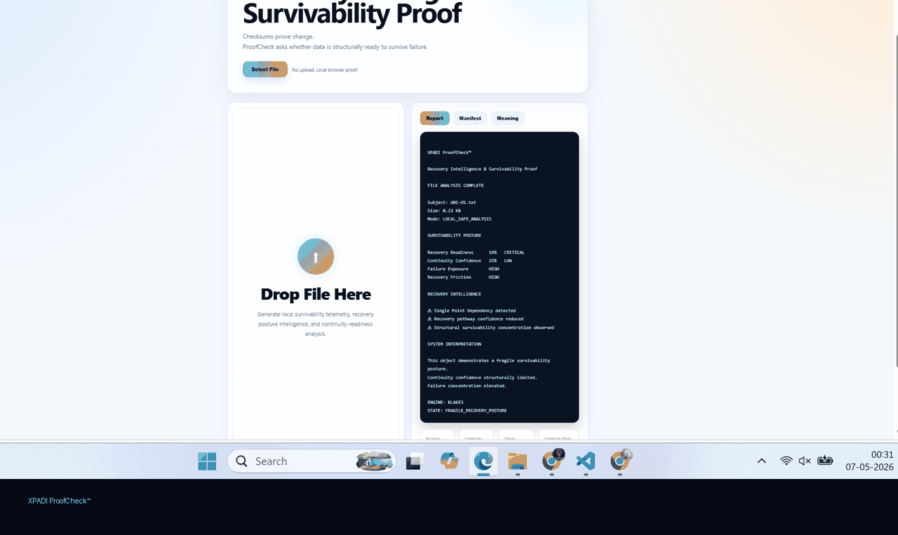
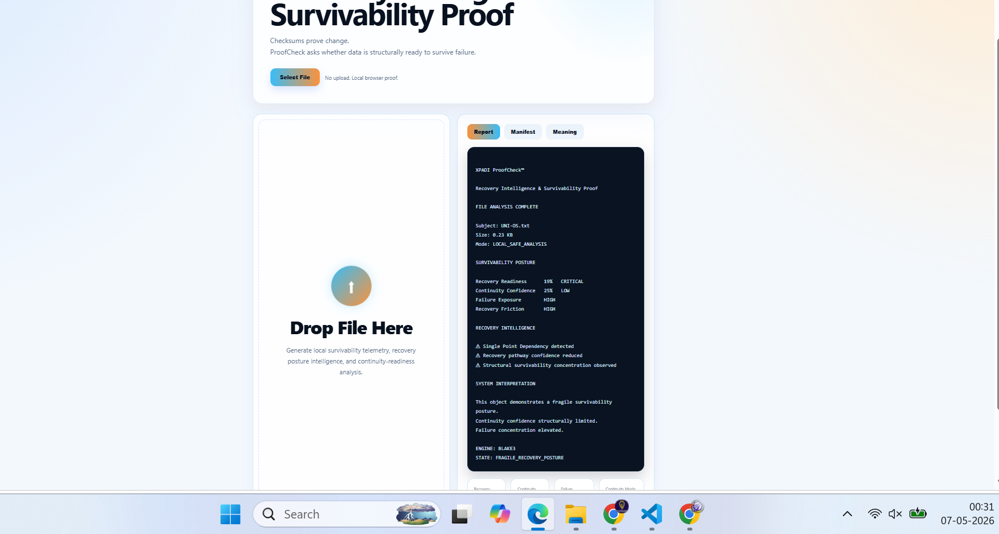
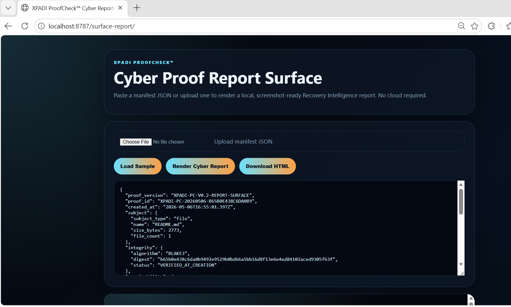
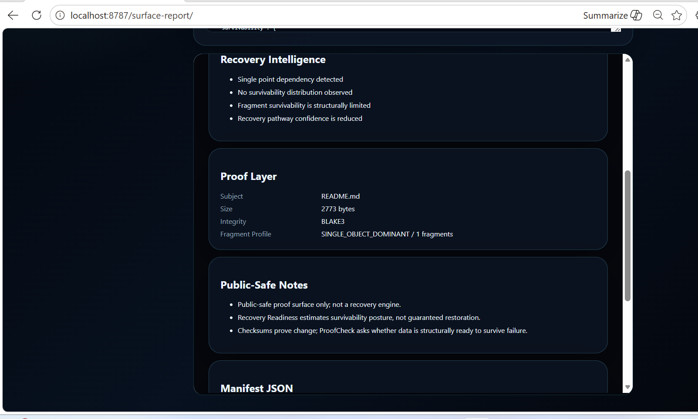
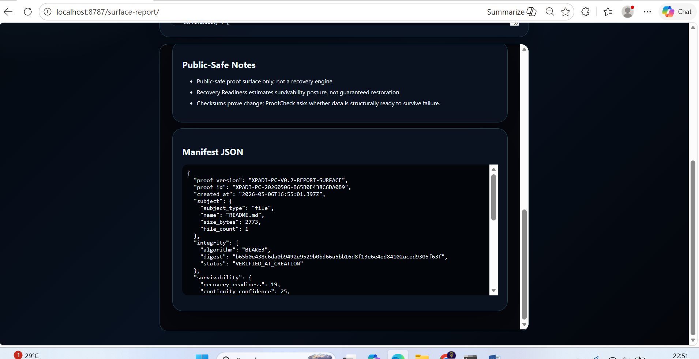
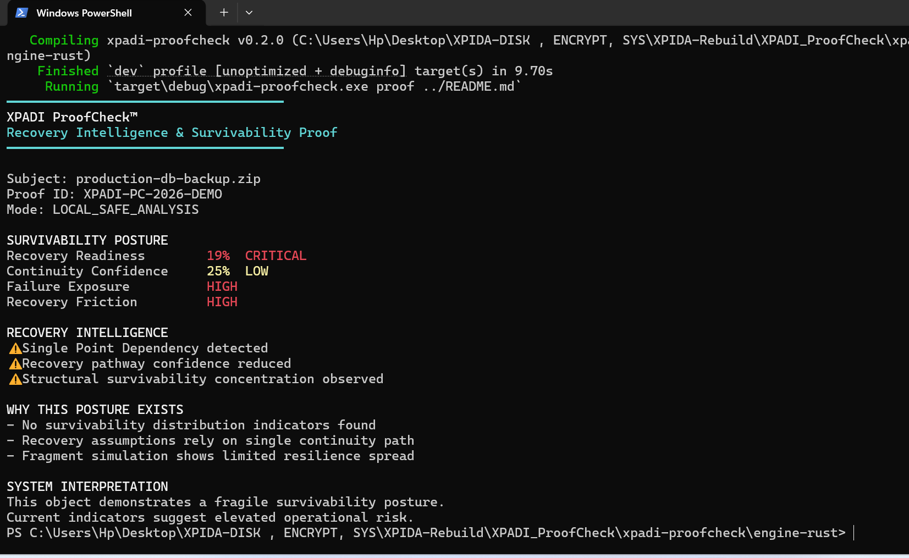

<p align="center">
  
</p>

<h1 align="center">XPADI ProofCheck™</h1>

<p align="center">
  <strong>Recovery Intelligence & Survivability Proof</strong>
</p>

<p align="center">
  Checksums prove change.<br>
  <strong>XPADI ProofCheck asks whether data is structurally ready to survive failure.</strong>
</p>

<p align="center">


</p>

---

# 🚨 What Is XPADI ProofCheck™

XPADI ProofCheck™ is a local-first survivability intelligence artifact.

It explores a different question from traditional systems:

> **If failure happens tomorrow — is recovery structurally believable?**

Most systems validate:
- integrity
- copies
- accessibility
- storage

XPADI ProofCheck™ explores:
- survivability posture
- continuity confidence
- failure exposure
- recovery readiness

---

# ⚡ Core Shift

| Traditional Systems | XPADI ProofCheck™ |
|---|---|
| Did the file change? | Can recovery survive failure? |
| Was backup created? | Is continuity structurally believable? |
| Is storage accessible? | Is survivability concentrated? |
| Is checksum valid? | Is recovery confidence fragile? |

---

# 🧠 Example Output

```txt
XPADI ProofCheck™

Recovery Intelligence & Survivability Proof

Recovery Readiness      19%   CRITICAL
Continuity Confidence   25%   LOW
Failure Exposure        HIGH
Recovery Friction       HIGH

STATE: FRAGILE_RECOVERY_POSTURE
```

---

# 👁 Human Meaning

When XPADI ProofCheck™ says:

```txt
FRAGILE_RECOVERY_POSTURE
```

It means:

> Recovery may exist, but continuity confidence appears structurally weak under failure conditions.

Simple example:

```txt
Backup exists.
But all continuity depends on one cloud account.
Failure exposure concentrated.
Recovery posture fragile.
```

---

# 🧩 Project Structure

```txt
xpadi-proofcheck/
│
├── engine-rust/
├── api-node/
├── web-demo/
├── surface-report/
├── assets/
├── docs/
├── proof-output/
└── README.md
```

---

# 🎬 Live Demo Surface

<p align="center">
  
</p>

<p align="center">
  <strong>Local-first survivability intelligence workflow</strong>
</p>

---

# 🖼 Screenshot Surfaces

## 🧠 Recovery Surface

<p align="center">
  
</p>

Shows:
- survivability posture
- recovery readiness
- continuity confidence
- operational recovery intelligence

---

## ⚙ Rust CLI Execution

<p align="center">
  
</p>

Local Rust execution surface generating survivability telemetry.

---

## 📊 Recovery Intelligence

<p align="center">
  
</p>

Operational continuity analysis:
- recovery posture
- failure exposure
- survivability concentration
- continuity confidence

---

## 🔒 Proof Layer + Public-Safe Surface

<p align="center">
  
</p>

Demonstrates:
- local proof generation
- manifest visibility
- public-safe telemetry
- local-first execution philosophy

---

## 🌐 Cyber Report Surface

<p align="center">
  
</p>

Browser-based survivability intelligence rendering surface.

---

# ⚙ Install Requirements

## 🦀 Install Rust

Download:

```txt
https://rustup.rs
```

Verify:

```bash
rustc --version
cargo --version
```

---

## 🌐 Install Node.js

Download:

```txt
https://nodejs.org
```

Verify:

```bash
node -v
npm -v
```

---

# 🚀 Run Rust Engine

```bash
cd engine-rust
cargo run -- proof ../README.md
```

Expected output:

```txt
Recovery Readiness      19%   CRITICAL
Continuity Confidence   25%   LOW
Failure Exposure        HIGH
Recovery Friction       HIGH
```

---

# 🌐 Surface Report

Run:

```bash
cd api-node
npm install
npm start
```

Open:

```txt
http://localhost:8787/surface-report/
```

---

# 🌐 Browser Demo

Open:

```txt
web-demo/index.html
```

Supports:

- 📂 Select File
- 🧲 Drag & Drop
- 📊 Recovery Report
- 📜 Manifest View
- 🧠 Meaning View
- 🌐 Local Browser Analysis

No upload required.

Everything runs locally.

---

# 🔄 Browser Demo Flow

## 1️⃣ Open Demo

```txt
web-demo/index.html
```

---

## 2️⃣ Select or Drop File

Use:

```txt
Select File
```

or:

```txt
Drop File Here
```

---

## 3️⃣ View Survivability Intelligence

Results include:

- 🔴 Recovery Readiness
- 🟠 Continuity Confidence
- 🔴 Failure Exposure
- 🔴 Recovery Friction
- ⚠ Survivability Posture

---

# 📘 Key Terms

| Term | Meaning |
|---|---|
| Recovery Readiness | Preparedness for recovery |
| Survivability Posture | Overall continuity condition |
| Continuity Confidence | Confidence in recoverability |
| Failure Exposure | Fragility under dependency failure |
| Recovery Friction | Difficulty restoring continuity |

---

# 🔒 Local-First Philosophy

XPADI ProofCheck™ is designed as a local-first artifact.

That means:

- ❌ no login
- ❌ no cloud upload
- ❌ no remote dependency
- ❌ no server-side storage
- ✅ local browser execution
- ✅ local proof generation

---

# 🛡 Public-Safe Intention

This public repo intentionally exposes only:

- survivability telemetry
- recovery posture reasoning
- continuity visibility
- local proof surface
- manifest intelligence

It intentionally does NOT expose:

- recovery internals
- reconstruction systems
- authority mechanics
- protected survivability architecture

---

# 🎯 Correct Positioning

✅ Recovery Intelligence & Survivability Proof

✅ Local-first survivability intelligence artifact

---

# 🧬 Core Philosophy

Most tools measure whether data changed.

XPADI ProofCheck™ explores whether recovery itself appears structurally believable.

Shift:

```txt
Integrity → Survivability
Backup → Continuity
Storage → Recovery Readiness
```

---

# ❓ Final Question

> Can recovery itself become measurable before failure happens?

That is the question behind XPADI ProofCheck™.

---

# 👤 Author

Raaj Mandale  
Founder — Eranest Technoware

### Research

- M-OS
- XPADI
- UNI-OS
- QBAIX

### GitHub

https://github.com/raajmandale

---

# 📄 License

MIT