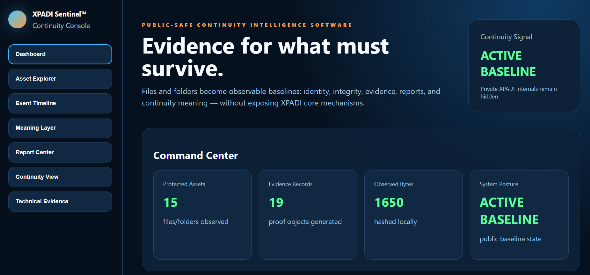
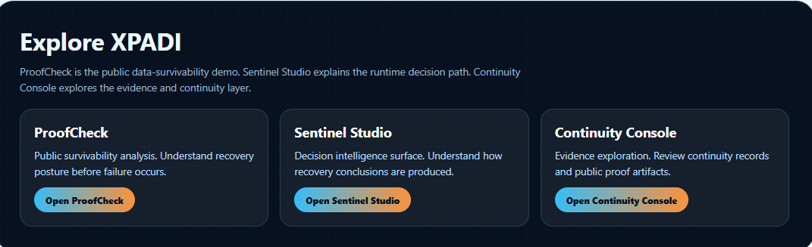

<p align="center">
  
</p>

<h1 align="center">XPADI ProofCheck™</h1>

<p align="center">
  <strong>Recovery Intelligence & Survivability Proof</strong>
</p>

<p align="center">
  Checksums prove change.<br>
  <strong>XPADI ProofCheck asks whether data is structurally ready to survive failure.</strong>
</p>

<p align="center">


</p>

<p align="center">
  <a href="https://xpadi.com/proofcheck/"><strong>🌐 Live ProofCheck Demo</strong></a>
  ·
  <a href="https://github.com/raajmandale/XPADI-SGDS"><strong>XPADI-SGDS Root</strong></a>
  ·
  <a href="./sentinel-studio/"><strong>Sentinel Studio</strong></a>
  ·
  <a href="./proofcheck-console/"><strong>Continuity Console</strong></a>
  ·
  <a href="./transcript/"><strong>Transcript Runtime</strong></a>
</p>

---

## 🌐 Live Surfaces

| Surface | Purpose | Link |
|---|---|---|
| **ProofCheck Demo** | Public survivability analysis | https://xpadi.com/proofcheck/ |
| **XPADI-SGDS** | Root XPADI survivability system direction | https://github.com/raajmandale/XPADI-SGDS |
| **XPADI ProofCheck** | Current public proof surface repository | https://github.com/raajmandale/XPADI-ProofCheck |
| **Sentinel Studio** | Decision intelligence surface | ./sentinel-studio/ |
| **Continuity Console** | Evidence and continuity exploration | ./proofcheck-console/ |
| **Transcript Runtime** | Runtime proof / execution surface | ./transcript/ |

---

## 🚨 What Is XPADI ProofCheck™

XPADI ProofCheck™ is a public-facing **Recovery Intelligence and Survivability Proof** surface.

Traditional tools usually ask:

> Did the file change?  
> Does a backup exist?  
> Is storage accessible?

XPADI ProofCheck asks a different question:

> **If failure happens tomorrow — is recovery structurally believable?**

It explores public-safe signals around:

- **Recovery Readiness**
- **Continuity Confidence**
- **Failure Exposure**
- **Survivability Posture**
- **Local Proof Generation**

The current repository is not the full XPADI system. It is the public proof and demonstration surface for the broader XPADI direction.

---

## 🧬 XPADI Direction

XPADI is built around a simple progression:

```txt
Protection First
        ↓
Survival Second
        ↓
Recovery Third
```

Protection reduces exposure.  
Survival reduces destruction.  
Recovery restores continuity after failure.

XPADI ProofCheck explores public-facing signals from this progression without exposing private XPADI internals.

---

## 🧭 XPADI Public Surface Architecture

XPADI ProofCheck now connects three public surfaces:

```txt
XPADI ProofCheck™
        ↓
XPADI Sentinel Studio™
        ↓
XPADI Continuity Console™
```

| Layer | Meaning |
|---|---|
| **XPADI ProofCheck™** | Public survivability demonstration: “Can this data survive failure?” |
| **XPADI Sentinel Studio™** | Decision intelligence: “Why was this posture produced?” |
| **XPADI Continuity Console™** | Evidence exploration: “What continuity records support this?” |

---

## ⚡ Core Shift

| Traditional Systems | XPADI ProofCheck™ |
|---|---|
| Did the file change? | Can recovery survive failure? |
| Was backup created? | Is continuity structurally believable? |
| Is storage accessible? | Is survivability concentrated? |
| Is checksum valid? | Is recovery confidence fragile? |

---

## 🎬 Live Demo Surface

<p align="center">
  
</p>

<p align="center">
  <strong>Local-first survivability intelligence workflow</strong>
</p>

---

## 🖼 Screenshot Surfaces

### 🧠 Recovery Surface

<p align="center">
  
</p>

Shows public survivability analysis, recovery readiness, continuity confidence, and human-readable recovery posture.

---

### ⚙ Rust CLI Execution

<p align="center">
  
</p>

Local Rust execution surface generating survivability telemetry.

---

### 📊 Recovery Intelligence

<p align="center">
  
</p>

Operational continuity analysis for recovery posture, failure exposure, survivability concentration, and continuity confidence.

---

### 🔒 Proof Layer + Public-Safe Surface

<p align="center">
  
</p>

Demonstrates local proof generation, manifest visibility, and public-safe telemetry.

---

### 🌐 Cyber Report Surface

<p align="center">
  
</p>

Browser-based survivability intelligence rendering surface.

---

### 📡 Evidence Intelligence Layer

<p align="center">
  
</p>

Sentinel-style evidence view showing continuity telemetry and public recovery-intelligence signals.

---

### 🧭 XPADI Ecosystem Bridge

<p align="center">
  
</p>

Shows how ProofCheck, Sentinel Studio, and Continuity Console connect as public-facing XPADI surfaces.

---

## 🧩 Project Structure

```txt
xpadi-proofcheck/

├── web-demo/                 # Public ProofCheck demo
├── sentinel-studio/          # Decision intelligence surface
├── proofcheck-console/       # Continuity and evidence console
├── transcript/               # Runtime / proof execution layer
├── proofcheck-pipeline/      # ProofCheck pipeline
├── folder-proof-audit/       # Folder-level proof audit
├── multi-file-proof-suite/   # Multi-file proof suite
├── engine-rust/              # Local Rust proof engine
├── api-node/                 # Local Node surface report
├── docs/                     # Canon, quickstart, release notes
├── assets/                   # Main visual assets
└── release-assets/           # Release screenshots and supporting visuals
```

---

## 🚀 Quick Start

### Browser Demo

Open:

```txt
web-demo/index.html
```

Supports:

- Select File
- Drag & Drop
- Recovery Report
- Manifest View
- Meaning View
- Local Browser Analysis

No upload required.

---

### Rust Engine

```bash
cd engine-rust
cargo run -- proof ../README.md
```

---

### Surface Report

```bash
cd api-node
npm install
npm start
```

Open:

```txt
http://localhost:8787/surface-report/
```

---

## 🔒 Public Repository Boundary

This repository intentionally exposes:

- survivability telemetry
- recovery posture reasoning
- continuity visibility
- local proof surfaces
- public-safe evidence views

This repository intentionally does **not** expose:

- recovery internals
- reconstruction systems
- authority mechanics
- protected survivability architecture
- private XPADI core mechanisms

---

## 🌐 Explore XPADI

ProofCheck is part of a broader survivability and continuity ecosystem.

| Surface | Purpose |
|---|---|
| **XPADI ProofCheck™** | Public Survivability Analysis |
| **XPADI Sentinel Studio™** | Decision Intelligence Surface |
| **XPADI Continuity Console™** | Evidence & Continuity Exploration |
| **XPADI-SGDS** | Root survivability-governed data system direction |

---

## 👤 Author

**Raaj Mandale**  
Founder — Eranest Technoware

Research / ecosystem direction:

- XPADI
- M-OS
- UNI-OS
- QBAIX

GitHub:  
https://github.com/raajmandale

---

## 📄 License

MIT
